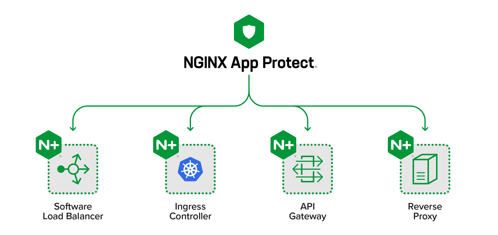

<h4 align="center">
  
</h4>

# Content
1. Information about Nginx
   - About Nginx
     - What is nginx?
	 - Supported NGINX functionality
	 - How work nginx?
   - Nginx configuration items and architecture
	 - Important configuration items
	 - Nginx architecture
2. Install Nginx
3. Example nginx.conf file configuration

# Information about Nginx

## About Nginx

###### What is nginx?
Nginx - is a free web and mail proxy server with non-threaded (asynchronous) architecture and open source.
	> **more information can be found on the [developer's website](https://nginx.org/).** 
		
###### Supported NGINX functionality

* *HTTP server*
* *Reverse proxy*
* *Mail proxy*
* *TCP / UDP proxy*
	
###### How work nginx?
Unlike a regular web server, Nginx does not create one thread for each request, but splits it into smaller 
structures of the same type, called working connections. Each such connection is processed by a separate 
workflow, and after execution they are merged into a single block that returns the result to the main data 
processing process. One working connection can process up to 1024 requests of the same type at the same time.
	
# Nginx configuration items and architecture

## Important configuration items
- worker_processes - the number of worker processes that the server will use. The number must match the number of processor cores.
- worker_connections is the maximum number of connections for each worker process. The higher the indicator, the more people are served at the same time.
- access_log & error_log - These files are used to log any error and access attempts. The logs are examined for troubleshooting and abnormal shutdowns.
- gzip are settings for 'compressing' Nginx requests. Enabling this setting will improve performance. By default, customizations are commented out.
- gzip_comp_level - compression level from 1 to 10. This figure usually does not exceed 6.
_ gzip_types is a list of response types to which compression is applied.

## Nginx architecture
There are 2 algorithms for work synchronous and asynchronous. With the synchronous algorithm, a separate thread is allocated for each stage of the task and the entire operation is performed step by step, that is, the program does not proceed to the next step until it finishes the previous one. Thus, some elements of the system periodically stand idle while waiting for their turn. Hence, there are two disadvantages of such a system:

- irrational use of resources,
- limited number of operations.
- This is how the Apache web server works, for example.

The asynchronous algorithm solved the problems listed above. With an asynchronous algorithm, the code still goes through everything step by step, but the system does not have to wait for one step to complete before moving on to the next. All tasks are carried out in one thread. The program is always aware of the entire process as a whole and can proceed to the next stage when the previous one is not yet completed. Nginx works according to the asynchronous algorithm. Thanks to this approach, working with Nginx allows you to:

- perform more operations,
- work faster
- save memory.

<h4 align="center">
  
</h4>

# 2. Install Nginx

## Установка nginx
nginx для каждой операционной системы устанавливается по разному.

## Установка на Linux
To install nginx on Linux, packages from nginx.org can be used. This document will cover installation on Linux

###### installation process:

###### Official Red Hat/CentOS packages

1. To add NGINX yum repository, create a file named /etc/yum.repos.d/nginx.repo and paste one of the configurations below:

CentOS:
	[nginx]
	name=nginx repo
	baseurl=https://nginx.org/packages/centos/$releasever/$basearch/
	gpgcheck=0
	enabled=1
	
RHEL:  
	[nginx]
	name=nginx repo
	baseurl=https://nginx.org/packages/rhel/$releasever/$basearch/
	gpgcheck=0
	enabled=1
	
> **WARNING!** Due to differences between how CentOS, RHEL, and Scientific Linux populate the $releasever variable, it is necessary to manually replace $releasever with either 5 (for 5.x) or 6 (for 6.x), depending upon your OS version.

2. To install, use the command *sudo yum install nginx*. We confirm the appeared notification.

3. To start the server, use the command:

	sudo systemctl start nginx.service

4. You can check if the installation was successful by visiting the server's public IP address. You can find it out through the command:

	ip addr show eth0 | grep inet | awk '{ print $2; }' | sed 's/\/.*$//'

5. To make Nginx automatically start when the OS boots, enter:

	sudo servicectl enable nginx.service

###### Official Debian/Ubuntu packages

###### Ubuntu:

The available NGINX Ubuntu release support is listed at this distribution page. For a mapping of Ubuntu versions to release names, please visit the Official Ubuntu Releases page.

Append the appropriate stanza to /etc/apt/sources.list. If there is concern about persistence of repository additions (i.e. DigitalOcean Droplets), the appropriate stanza may instead be added to a different list file under /etc/apt/sources.list.d/, such as /etc/apt/sources.list.d/nginx.list.

	## Replace $release with your corresponding Ubuntu release.
	deb https://nginx.org/packages/ubuntu/ $release nginx
	deb-src https://nginx.org/packages/ubuntu/ $release nginx

e.g. Ubuntu 20.04 (Focal Fossa):

	deb https://nginx.org/packages/ubuntu/ focal nginx
	deb-src https://nginx.org/packages/ubuntu/ focal nginx

To install the packages, execute in your shell:

	sudo apt update
	sudo apt install nginx

If a W: GPG error: https://nginx.org/packages/ubuntu focal InRelease: The following signatures couldn't be verified because the public key is not available: NO_PUBKEY $key is encountered during the NGINX repository update, execute the following:

	## Replace $key with the corresponding $key from your GPG error.
	sudo apt-key adv --keyserver keyserver.ubuntu.com --recv-keys $key
	sudo apt update
	sudo apt install nginx

You have now nginx installed on your server but not ready to serve web pages. you have to start the nginx. You can do this by using this command:

	sudo systemctl start nginx

###### Debian 6:

Append the appropriate stanza to /etc/apt/sources.list.

	deb https://nginx.org/packages/debian/ squeeze nginx
	deb-src https://nginx.org/packages/debian/ squeeze nginx

###### Ubuntu PPA
This PPA is maintained by volunteers and is not distributed by nginx.org. It has some additional compiled-in modules and may be more fitting for your environment.

You can get the latest stable version of NGINX from the NGINX PPA on Launchpad: You will need to have root privileges to perform the following commands.

For Ubuntu 20.04 and newer:

	sudo -s
	nginx=stable # use nginx=development for latest development version
	add-apt-repository ppa:nginx/$nginx
	apt update
	apt install nginx

If you get an error about add-apt-repository not existing, you will want to install python-software-properties. For other Debian/Ubuntu based distributions, 
you can try the lucid variant of the PPA which is the most likely to work on older package sets:

	sudo -s
	nginx=stable # use nginx=development for latest development version
	echo "deb http://ppa.launchpad.net/nginx/$nginx/ubuntu lucid main" > /etc/apt/sources.list.d/nginx-$nginx-lucid.list
	apt-key adv --keyserver keyserver.ubuntu.com --recv-keys C300EE8C
	apt update
	apt install nginx

###### Установка на FreeBSD
На FreeBSD можно установить nginx либо из пакетов, либо с помощью системы портов. Система портов даёт большую гибкость, позволяя выбирать из широкого набора настроек. Порт скомпилирует nginx с выбранными опциями и установит.

###### Сборка из исходных файлов
Если необходима специфическая функциональность, недоступная из пакетов или портов, можно скомпилировать nginx из исходного кода. Будучи наиболее гибким, этот подход может быть сложным для начинающего. Сборка nginx из исходных файлов освещает этот вопрос более подробно.

3. Example nginx.conf file configuration

Example nginx.conf file configuration you can see in [file](./nginx.conf)

